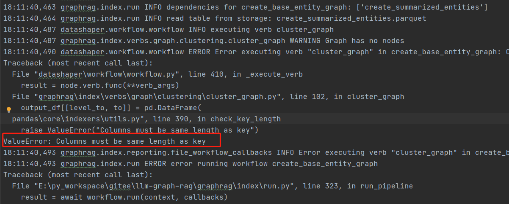

# graphrag常见问题汇总

在接入过来的大模型时，会碰到各种各样的问题，这里梳理了一下接入过来大模型的graphrag碰到的问题

## 执行到中途会失败

在执行过程中，模型的调用分为实体抽取，摘要生成，社区报告生成等流程，输入文本文件的长度不同，可能会在不同环节报错，如下：
错误1：

错误2：

### 原因分析
这里问题主要是因为模型的并发限制或最大长度token限制，根据实际模型调整即可
### 解决方案
graphrag的默认大模型调用和embedding模型并发都是25pm，很多的大模型平台是不支持这么高的并发的，只需要在settings.yaml文件中修改即可

    concurrent_requests: 25
对于最大token长度限制，可以适当改小，根据实际模型修改
    
    max_tokens: 4000

## 列长度一致错误



## 中途中断，避免每次运行重复执行成功的部分
中途中断，很多时候是因为请求次数超过限制，如下图：


按照官方的代码```python -m graphrag.index --root ./ragtest```, 每次重新运行都会从头开始执行，如果在最后一步执行出错，重新执行又要从头开始执行，会大大浪费token，
为避免这类情况，可以增加一个参数

    python -m graphrag.index --root ./ragtest --resume test

resume参数是指定run_id，默认是根据当前时间生成，不指定该数据，每次就会重新生成run_id,也就会从头开始执行，增加该参数就可以避免。

## 构建索引成功


## 构建索引后检索

### 检索成功示例


## 检索上的参数指定
在实际的测试中，在结果生成目录下output可能会有多个结果，此时可以通过data参数指定具体的最优结果，否则会默认读取第一个，如下：
    
    python -m graphrag.query --root ./ragtest --data ./ragtest/output/test/artifacts --method local "Who is Scrooge, and what are his main relationships?"

